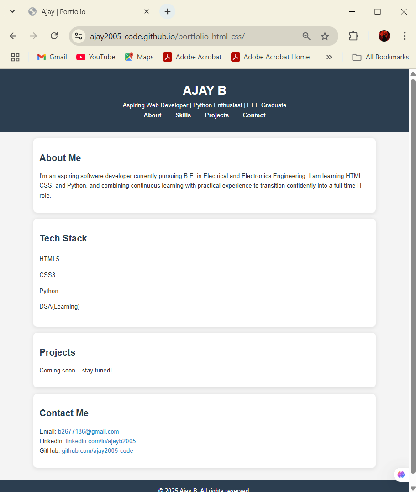

# 💼 Personal Portfolio Website

This is my first portfolio website built using only HTML5 and CSS3. It showcases my profile, skills, and project highlights.

## 🔧 Tech Stack
- HTML5
- CSS3

## 🚀 Live Demo
👉 [Click here to view](https://ajay2005-code.github.io/portfolio-html-css/)

## 📸 Screenshot

## 📁 Features
- Clean and responsive design
- About Me, Skills, and Contact sections
- Deployed using GitHub Pages
